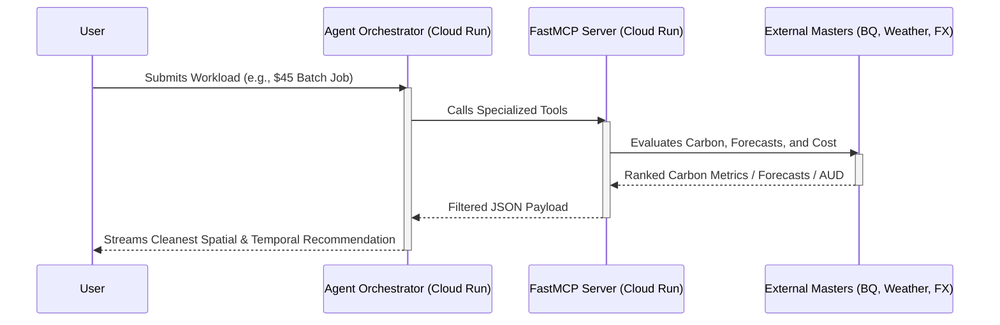

# 🌿 GreenOps: Carbon-Aware Compute Routing Agent

<div align="center">
  
  
  
  
</div>

<br/>

**A Winner-Ready Serverless Solution for the Google Cloud Gen AI Academy APAC — Track 2.**

GreenOps is an autonomous, 100% serverless, zero-cost AI agent built with **Google Agent Development Kit (ADK)** and the **Model Context Protocol (MCP)**. Evolving into a proactive **Mixture of Masters**, it does more than just route compute workloads to the cleanest Google Cloud regions—it actively orchestrates Temporal, Financial, and Spatial domains to optimize your infrastructure.

---

## 🚀 Live Demo

- **Interactive Web UI**: [GreenOps ADK Web Interface](https://greenops-agent-app-73907097560.us-central1.run.app/dev-ui/)
- **FastMCP API Endpoint**: `https://greenops-mcp-73907097560.us-central1.run.app/sse`

---

## ✨ Key Features & The Mixture of Masters

1. **Spatial Master (Carbon Routing):** Queries the official `bigquery-public-data.google_cfe.datacenter_cfe` dataset to recommend the optimal deployment region (e.g., `europe-north2` operating at 100% CFE).
2. **Temporal Master (Weather Forecasting):** Integrates the free [Open-Meteo](https://open-meteo.com/en/docs) API to predict upcoming spikes in wind and solar energy, allowing the agent to recommend delaying workloads for maximum carbon efficiency.
3. **FinOps Master (Cost Localization):** Uses the [Frankfurter](https://www.frankfurter.app/docs/) FX API to instantly convert USD cloud cost estimates into your local currency.
4. **Autonomous Testing Master (QA):** Features a dedicated Python testing pipeline (`tests/testing_master.py`) utilizing `pytest` and an isolated `LlmAgent` to routinely smoke-test the orchestrator and flag hallucinations.
5. **Zero Financial Cost:** Architected strictly for "Always Free" tiers. Everything operates inside Google Cloud Run and BigQuery's free tiers, making it globally accessible at zero marginal cost.

---

## 🛠️ Architecture

GreenOps utilizes a token-efficient architecture using FastMCP to bridge ADK to the domain Masters:



### Component Breakdown
- **ADK Agent Service (`greenops_agent/agent.py`)**: Powered by Google Gemini 2.5 Flash, functioning as the Orchestrator for the user dialogue. Served securely via a custom FastAPI wrapper.
- **FastMCP Server (`mcp_server/main.py`)**: The data connector conforming to the Model Context Protocol. Exposes semantic tools mapping to the BigQuery, Open-Meteo, and Frankfurter APIs.
- **Testing Master (`tests/testing_master.py`)**: A programmatic evaluation framework that validates the Orchestrator's SimpleMEM formatting and constraint adherence.

---

## 📦 Local Development

### 1. Environment Setup
```bash
git clone https://github.com/Danish2op/GreenOps-MCP-Agent.git
cd GreenOps-MCP-Agent

# Virtual Environment Setup
python -m venv .venv
source .venv/bin/activate
pip install -r requirements.txt
```

### 2. Configure Environment Variables
Create a `.env` file using the provided template:
```bash
cp .env.example .env
# Edit `.env` to include your GOOGLE_API_KEY and GCP_PROJECT_ID
```

### 3. Launch the Architecture
You must launch both the MCP Server and the Agent App:
```bash
# Terminal 1: Start the MCP Server
python -m mcp_server.main

# Terminal 2: Start the Hardened ADK Web UI
python agent_app.py
```

---

## 🚢 Deployment (Google Cloud Run)

GreenOps is optimized for containerized deployment.

### Deploy the MCP Server
```bash
gcloud run deploy greenops-mcp \
  --source . \
  --region us-central1 \
  --allow-unauthenticated \
  --project greenops-agent
```

### Deploy the ADK Agent Application
```bash
# IMPORTANT: Move Dockerfiles temporarily to ensure correct target builds
mv Dockerfile.agent Dockerfile
gcloud run deploy greenops-agent-app \
  --source . \
  --region us-central1 \
  --allow-unauthenticated \
  --project greenops-agent
git restore Dockerfile
```

---

## 📊 Verification Metrics
The agent safely uses verified API data and successfully identifies metrics such as:
- **Cleanest Global Region**: `europe-north2` (Finland) consistently operating at **100% CFE**.
- **Cleanest US Region**: `us-south1` (Dallas) operating at **94% CFE**.

---

## 📄 License
MIT © 2026 Danish Sharma
