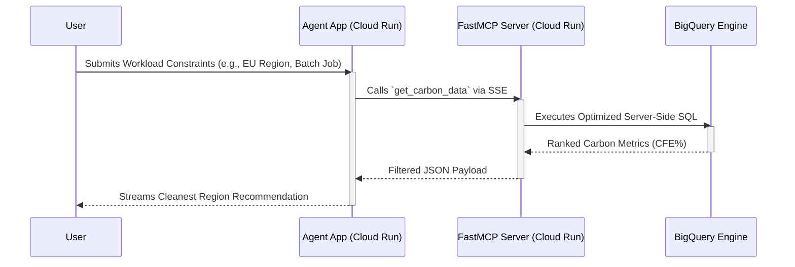

# 🌿 GreenOps: Carbon-Aware Compute Routing Agent

<div align="center">
  
  
  
  
</div>

<br/>

**A Winner-Ready Serverless Solution for the Google Cloud Gen AI Academy APAC — Track 2.**

GreenOps is an autonomous, 100% serverless, zero-cost AI agent built with **Google Agent Development Kit (ADK)** and the **Model Context Protocol (MCP)**. It dynamically routes compute workloads to the cleanest Google Cloud regions by evaluating real-time **Carbon-Free Energy (CFE%)** and **Grid Carbon Intensity** metrics. 

---

## 🚀 Live Demo

- **Interactive Web UI**: [GreenOps ADK Web Interface](https://greenops-agent-app-73907097560.us-central1.run.app/dev-ui/)
- **FastMCP API Endpoint**: `https://greenops-mcp-73907097560.us-central1.run.app/sse`

---

## ✨ Key Features & Innovations

1. **Deterministic Data-Driven Routing:** Queries the official `bigquery-public-data.google_cfe.datacenter_cfe` dataset to recommend the optimal deployment region (e.g., `europe-north2` operating at 100% CFE).
2. **Zero Financial Cost:** Architected strictly for "Always Free" tiers. Everything operates inside Google Cloud Run and BigQuery's free tiers, making it globally accessible at zero marginal cost.
3. **Advanced LLM Patterns:**
   - **SimpleMEM Framework**: Semantic structured compression converts raw data into context-independent units, eliminating bloated context windows.
   - **Recursive Language Models (RLM)**: All heavy SQL execution, schema probing, and data aggregations are done *server-side*, shipping only compact, ranked constraints to the LLM.

---

## 🛠️ Architecture

GreenOps utilizes a highly constrained, token-efficient architecture using FastMCP to bridge ADK and BigQuery:



### Component Breakdown
- **ADK Agent Service (`agents/greenops_agent/`)**: Powered by Google Gemini 2.5 Flash, functioning as the reasoning engine for the user dialogue. Served via a custom FastAPI `agent_app.py` wrapper.
- **FastMCP Server (`mcp_server/main.py`)**: The data connector conforming to the Model Context Protocol. Exposes exactly one semantic tool (`get_carbon_data`).
- **BigQuery Client (`mcp_server/bq_client.py`)**: Executes deterministic SQL to prevent LLM hallucinations about real-world carbon datasets.

---

## 📦 Local Development

### 1. Environment Setup
```bash
git clone https://github.com/Danish2op/GreenOps-MCP-Agent.git
cd GreenOps-MCP-Agent

# Virtual Environment Setup
python -m venv .venv
source .venv/bin/activate
pip install -r requirements.txt
```

### 2. Configure Environment Variables
Create a `.env` file using the provided template:
```bash
cp .env.example .env
# Edit `.env` to include your GOOGLE_API_KEY and GCP_PROJECT_ID
```

### 3. Launch the Architecture
You must launch both the MCP Server and the Agent App:
```bash
# Terminal 1: Start the MCP Server
python -m mcp_server.main

# Terminal 2: Start the ADK Web UI
python agent_app.py
```

---

## 🚢 Deployment (Google Cloud Run)

GreenOps is optimized for containerized deployment.

### Deploy the MCP Server
```bash
gcloud run deploy greenops-mcp \
  --source . \
  --region us-central1 \
  --allow-unauthenticated \
  --project greenops-agent
```

### Deploy the ADK Agent Application
```bash
# IMPORTANT: Move Dockerfiles temporarily to ensure correct target builds
mv Dockerfile.mcp Dockerfile.mcp_tmp
mv Dockerfile.agent Dockerfile
gcloud run deploy greenops-agent-app \
  --source . \
  --region us-central1 \
  --allow-unauthenticated \
  --project greenops-agent
mv Dockerfile Dockerfile.agent
mv Dockerfile.mcp_tmp Dockerfile.mcp
```

---

## 📊 Verification Metrics
The agent strictly uses verified BigQuery data and successfully identifies regional metrics such as:
- **Cleanest Global Region**: `europe-north2` (Finland) consistently operating at **100% CFE**.
- **Cleanest US Region**: `us-south1` (Dallas) operating at **94% CFE**.

---

## 📄 License
MIT © 2026 Danish Sharma
