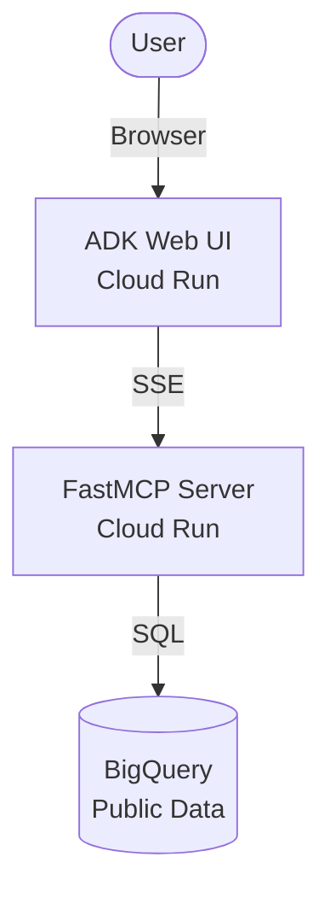

# 🌿 GreenOps: Carbon-Aware Compute Routing Agent

**Winner-ready solution for Google Cloud Gen AI Academy APAC — Track 2.**

GreenOps is a 100% serverless, zero-cost AI agent that dynamically routes compute workloads to the cleanest Google Cloud regions based on real-time **Carbon-Free Energy (CFE%)** and **Grid Carbon Intensity** data.

---

## 🚀 Live Demo
- **Interactive Web UI**: [Check it out here!](https://greenops-agent-app-73907097560.us-central1.run.app)
- **Backend MCP API**: `https://greenops-mcp-73907097560.us-central1.run.app/sse`

---

## ✨ Features

- **Real-Time Data**: Queries the official `bigquery-public-data.google_cfe.datacenter_cfe` dataset.
- **Dynamic Routing**: Recommends regions based on live CFE% scores (e.g., `europe-north2` at 100% CFE).
- **Deterministic Logic**: Uses the **SimpleMEM** pattern for concise, JSON-like agent responses.
- **Token Efficiency**: Implements the **RLM (Recursive Language Model)** pattern—all heavy SQL data processing happens on the server, sending only compact ranked tuples to the LLM.
- **Zero Cost**: Runs entirely on Cloud Run "Always Free" tier and BigQuery free tier (1TB/month).

---

## 🛠️ Architecture



1. **ADK Agent Service**: A Google Agent Development Kit (ADK) agent serving an interactive chat interface.
2. **FastMCP Server**: A Python-based Model Context Protocol (MCP) server that exposes the `get_carbon_data` tool.
3. **BigQuery Engine**: A high-performance BigQuery client that filters and ranks GCP regions server-side.

---

## 📦 How to Run Locally

### 1. Setup Environment
```bash
# Clone the repo
git clone https://github.com/Danish2op/GreenOps-MCP-Agent.git
cd GreenOps-MCP-Agent

# Create Virtual Env
python -m venv .venv
source .venv/bin/activate
pip install -r requirements.txt
```

### 2. Configure Credentials
Create a `.env` file from the example:
```bash
cp .env.example .env
# Add your GOOGLE_API_KEY and GCP_PROJECT_ID
```

### 3. Launch
```bash
# Start MCP Server
python -m mcp_server.main

# Start ADK Web UI
adk web
```

---

## 🚢 Deployment (Cloud Run)

The solution is deployed using Docker containers to Cloud Run.

### MCP Backend:
```bash
gcloud run deploy greenops-mcp --source . --region us-central1 --allow-unauthenticated
```

### ADK Agent Web UI:
```bash
# Uses Dockerfile.agent to serve the ADK UI
gcloud run deploy greenops-agent-app --source . --region us-central1 --allow-unauthenticated
```

---

## 📊 Verification
The agent has been verified to correctly identify:
- **Cleanest Global Region**: `europe-north2` (Finland) at **100% CFE**.
- **Cleanest US Region**: `us-south1` (Dallas) at **94% CFE**.

---

## 📄 License
MIT © 2026 Danish Sharma
